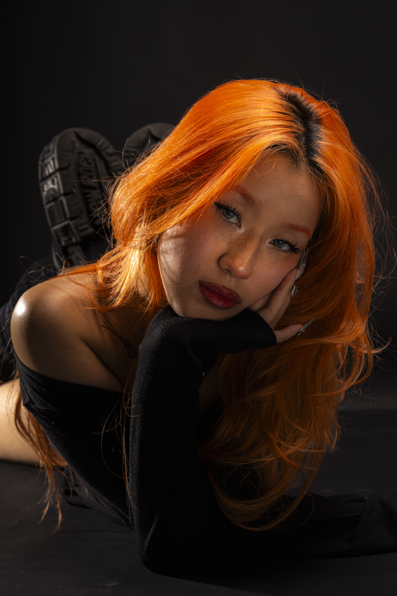

# Hey!

I am Diana Huong Nguyen, a contemporary artist working at the intersection of dance and graphic design.

My practice is storytelling-driven, and relentlessly expressive. I come from a background rooted in hip-hop, experimental, and jazz-funk, and I continuously explore other styles to broaden my movement vocabulary. This ongoing curiosity makes me a versatile dancer with no rigid boundaries—and it informs every aspect of my work.

In my dance, movement is a language I use to depict emotion and intention. I translate rhythm, flow, and tension into visual form, so the energy I feel on the floor breathes life into my graphics. My design projects capture sense of motion and purpose: visuals that feel alive, and that reveal new meaning with each viewing.
I like to create my work, my way, embracing experimentation and intuition over rigid rules. This approach keeps my work dynamic and surprising, encouraging viewers to pause, observe, and engage more deeply. My process is collaborative and iterative—ideas are sketched, tested, and refined until they resonate both physically and emotionally.

If you’re interested in commissions I’d love to hear about your ideas. Let’s create something that moves and meaningfully connects with people. <3

https://www.behance.net/dianahnguyen1 
