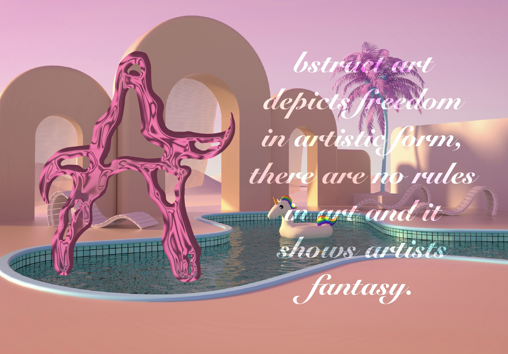
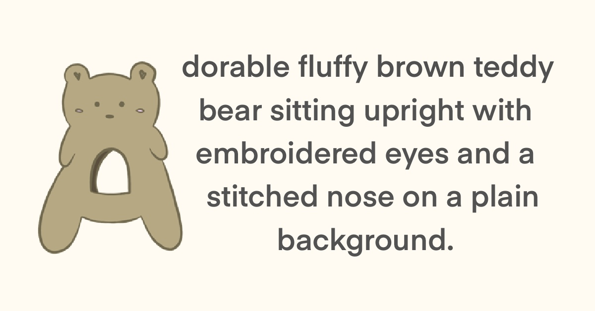

# Image description 
### Abstract, glossy pink 3D shape resembling a distorted letter "A" on a white background.

## ALT TEXT WITHOUT AI ASSISTANCE 

Glossy pink abstract form shaped like a melting letter A, floating on a white background with a playful, fluid feel.

Iteration notes:
- Focus on playful, childlike spirit 
- Used 3D chrome effect in Photoshop 

## ALT TEXT 2 - TECHNICAL 

Pink, reflective 3D abstract object forming a distorted letter A with smooth curves and cutouts on a white background.

Iteration notes:
- Focused on material, color, and form
- Avoided emotional language
- Prioritized clarity and structure

## AI draft 1 - edited version

Final edited text:
Shiny pink abstract 3D shape resembling a warped letter A, with fluid curves and hollow spaces on white.
Character count: 99

What I changed & why:
- Shortened sentence for accessibility
- Replaced "highly stylized" with clearer language
- Reduced adjectives to avoid redundancy

## AI draft 2 - edited version
Final edited text:
Glossy pink sculptural form suggesting the letter A, appearing soft and liquid-like against a clean white background.
Character count: 104

What I changed & why:
- Added "suggesting" to avoid over-specific interpretation
- Balanced emotion with description
- Kept within ideal character length

## Final synthesized alt text 

Glossy pink abstract 3D form suggesting a fluid, distorted letter A, with smooth curves and hollow details on white.
Character count: 112

Why this works best:
- Combines emotional tone + technical clarity
- Describes shape, material, and mood
- Concise, accessible, and meaningful

## Chrome A - Metada image 

  ## Teddy Bear - Metadata image
 
Title: Classic Brown Plush Teddy Bear

Description: A classic, cuddly stuffed bear featuring velvety fur and a friendly face. This durable plush toy is designed for endless hugs and comfort.

