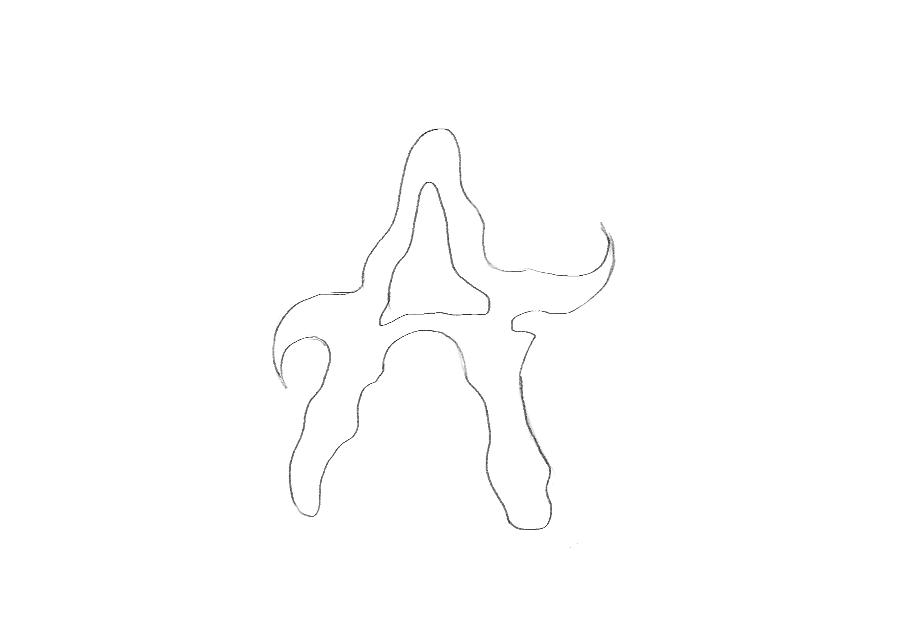
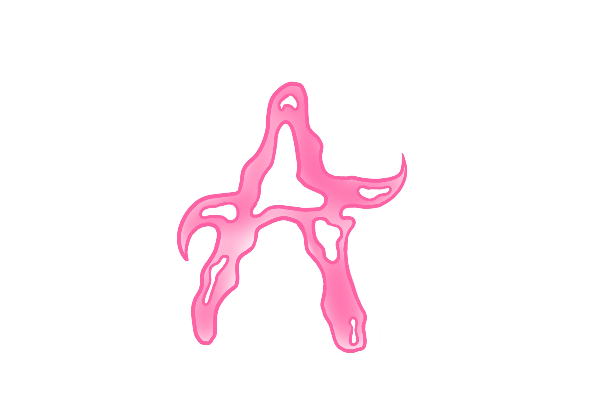

# Bespoke character

I was aiming for creating something fun and unusal. :3

## Process: 

- raw sketch of a letter A

- adding colour pink to make it look more alive and playful.

- finalizing in Photoshop by adding bevel emboss and stroke to create more of a chrome 3D letter A.

## Final bespoke character:
 
