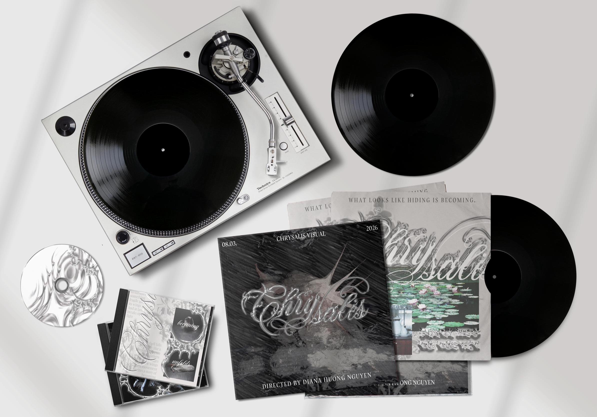

# Case Study: *Chrysalis Dance Visual*

> *A visual identity and dance project exploring transformation, rebirth, and identity through movement, storytelling, and immersive design.*

---

## Project Overview

| Category | Details |

|---|---|

| **Project Type** | Bachelor’s Thesis – Visual Identity & Dance Video |

| **Deliverables** | Logo, Posters, Tickets, Social Media, Invitations, CD & Vinyl Packaging |

| **Theme** | Transformation & Rediscovery of Identity |

| **Premiere Date** | 21/12/2026 |

| **Location** | ARCHA+ |

---

# The Concept

The word **Chrysalis** represents transformation — a protected yet vulnerable stage of rebirth before emergence. Through this project, I wanted to tell a story not only through movement and choreography, but also through the graphic deliverables surrounding the performance.

My goal was to evoke emotion, encourage self-reflection, and remind people of the deeper parts of their identity that are often lost over time.

---

# Meaning

The visual project explores the process of personal transformation and the rediscovery of identity.

As people grow older, their minds become shaped by expectations, doubts, and external influences, causing them to slowly lose the perspective and imagination they once had as children — a time when everything felt possible.

The narrative follows several stages:

1. **Awareness** — represented by the blooming lotus flower.

2. **Conflict** — positive and negative thoughts collide through movement.

3. **Transformation** — the symbolic chrysalis forms.

4. **Rebirth** — the protagonist emerges transformed.

---

# Branding & Visual Assets

The visual identity was designed to feel **portable**, **fluid**, and adaptable across both physical and digital spaces.

The logo became one of the project’s central storytelling elements. Its chrome-textured script was inspired by the fluidity of dance movement, resembling liquid metal frozen in motion.

## Design Elements

- Chrome typography

- Organic textures

- Reflective surfaces

- Tribal-inspired ornaments

- Ethereal visual atmosphere

---

*Figure 1: Primary Chrysalis logo design.*

---

*Figure 2: Stone-inspired logo variation exploring contrast between organic and metallic textures.*

---

# The Ticket

Styled as a thermal-printed receipt, the ticket transforms practical event information into part of the visual narrative itself.

Instead of presenting details traditionally, the design fragments the information into “chunks,” mimicking the appearance of a printed transaction slip.

### Event Information

| Detail | Information |

|---|---|

| **Premiere Date** | 21/12/2026 |

| **Time** | 20PM |

| **Location** | ARCHA+ |

---

*Figure 3: Ticket design inspired by thermal receipt aesthetics.*

---

# Music Packaging

The physical deliverables were designed to extend the atmosphere of the project into tangible objects.

## Vinyl

- Large-format sleeves

- High-contrast photography

- “Chrysalis” wordmark

## CD

- Metallic reflective surface

- Lyric and poetry booklets

- Chrome-inspired visuals

## Invitations

- Cream-toned paper

- Wax seals

- Delicate typography

---

*Figure 4: CD and vinyl packaging system.*

---

*Figure 5: Invitation design introducing the audience to the visual world of the performance.*

---

# Digital & Social Strategy

Following the principles of **accessible language** and **emotional clarity**, the social media campaign was designed to build anticipation and extend the project’s atmosphere online.

## Social Media Content

- Instagram grid visuals

- Behind-the-scenes clips

- “Rebirth” teaser posters

- Liquid-metal countdown templates

## Release Countdown

| Platform | Content Type | Goal |

|---|---|---|

| Instagram Stories | Countdown Templates | Build anticipation |

| Instagram Grid | Photography & Posters | Establish visual identity |

| Reels | Dance Snippets | Connect movement with branding |

---

*Figure 6: Instagram visual promoting the Chrysalis narrative.*

---

*Figure 7: Social media teaser poster.*

---

*Figure 8: Motion-inspired digital campaign visual.*

---

# Poster Series: *The Becoming Trio*

The poster campaign was divided into three visual chapters:

1. **The Process**  

   Fragmented motion photography framed within chrome structures.

2. **The Cast**  

   Structured layouts introducing the 2026 performers.

3. **The Environment**  

   Surreal compositions blending nostalgia and high-fashion typography.

---

*Figure 9: “The Becoming Trio” poster campaign.*

---

# Chrysalis Poster Series *(Dark Edition)*

> *“The old self disappears before a new form can emerge.”*

These posters focus on the tension of rebirth — the collision between softness and aggression, vulnerability and strength.

## Visual Characteristics

- Sharp textures

- Fluid movement photography

- Dark surrealist atmosphere

- Metallic contrast

---

*Figure 10: Dark Edition poster series exploring transformation and collision.*

---

# What Worked and What Didn’t

At first, I struggled with finding the right aesthetic structure because I wanted to create a clear storyline throughout all of the graphic design deliverables.

The biggest challenge was balancing two opposite aesthetics while still maintaining a cohesive identity.

Eventually, I realized that **storytelling itself** could become the element connecting every deliverable together.

Another challenge was combining a calligraphic font with modern typography without losing the ethereal atmosphere of the project.

However, introducing chrome liquid and tribal-inspired ornaments helped the visuals feel more dynamic and expressive, allowing static graphics to evoke movement and reflect the physicality of dance.

---

## Key Takeaways

### What Worked

- Cohesive storytelling

- Emotional visual language

- Strong contrast between organic and metallic elements

- Integration of movement into static design

### Challenges

- Balancing romantic and modern typography

- Connecting opposite visual aesthetics

- Maintaining consistency across deliverables

---

> *In the end, the project became more than a visual identity — it evolved into an immersive emotional experience combining dance, movement, and graphic storytelling.*

# Deliverables Overview

| Deliverable | Description | Visual Elements | Purpose |

|---|---|---|---|

| **Logo Design** | Chrome-textured script inspired by dance movement | Liquid chrome, organic textures, reflective typography | Represents transformation and movement |

| **Posters** | Narrative-driven campaign visuals | High contrast photography, surreal compositions, chrome frames | Build atmosphere and storytelling |

| **Tickets** | Thermal receipt-inspired event ticket | Fragmented typography, monochrome aesthetic | Transform information into visual narrative |

| **Vinyl Packaging** | Large-format music packaging | Cinematic photography, bold typography | Extend the project into physical media |

| **CD Design** | Reflective metallic disc with booklet | Chrome textures, poetry inserts | Create immersive tactile experience |

| **Invitations** | Ceremonial audience invitation | Cream paper, wax seals, delicate typography | Introduce audience into the project world |

| **Social Media** | Instagram campaign and teaser content | Motion-inspired edits, countdown visuals | Build anticipation and engagement |

---

# Visual Identity Comparison

| Organic Elements | Metallic Elements |

|---|---|

| Lotus flowers | Chrome typography |

| Lily pads | Reflective surfaces |

| Soft movement | Sharp textures |

| Childhood symbolism | Industrial aesthetics |

| Emotional vulnerability | Futuristic visuals |

---

# Project Timeline

| Stage | Description |

|---|---|

| **Research & Concept Development** | Exploration of transformation, rebirth, and identity |

| **Visual Identity Design** | Development of logo, typography, and aesthetic system |

| **Dance Video Production** | Choreography, filming, and narrative creation |

| **Print Deliverables** | Posters, invitations, tickets, CD & vinyl packaging |

| **Digital Campaign** | Instagram visuals, teaser content, release countdown |

| **Final Presentation** | Exhibition and performance premiere |
