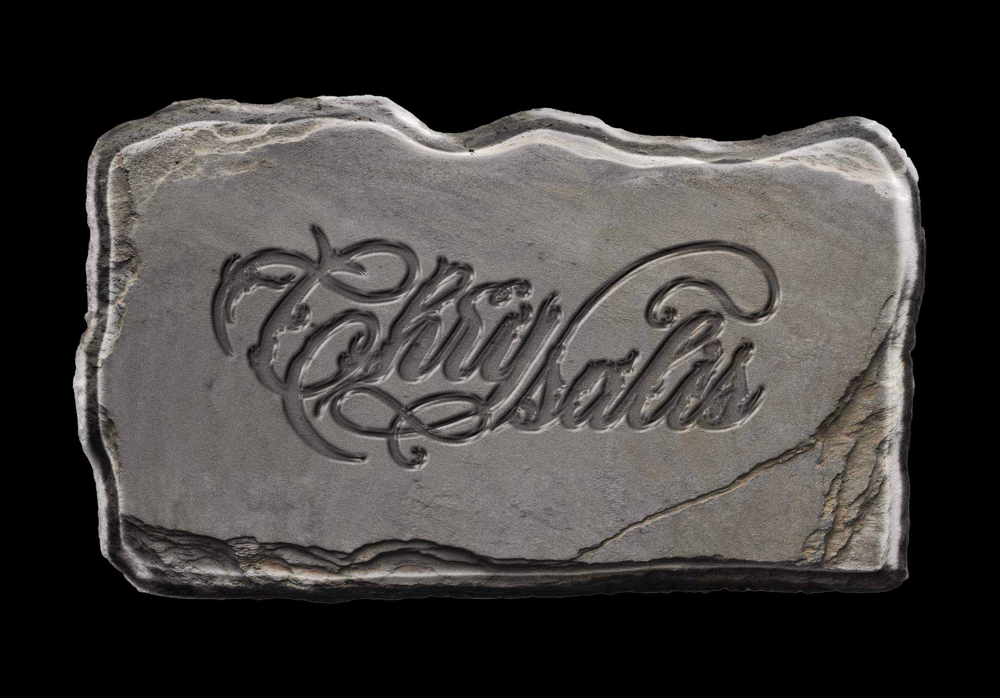
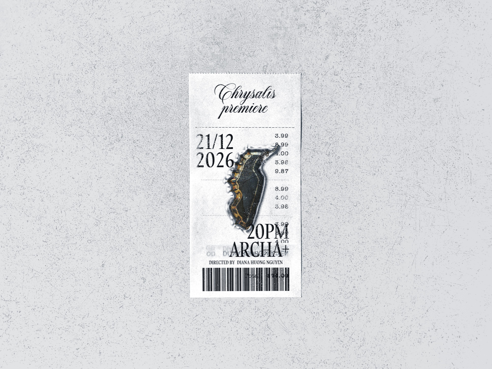
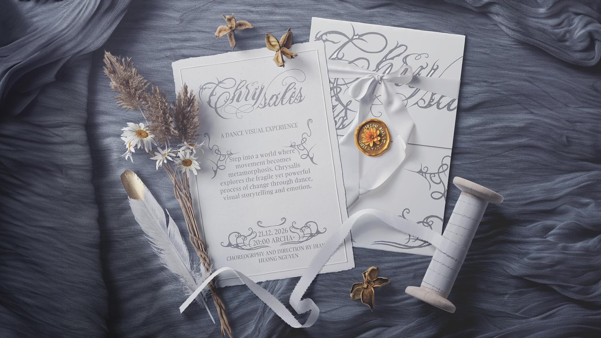
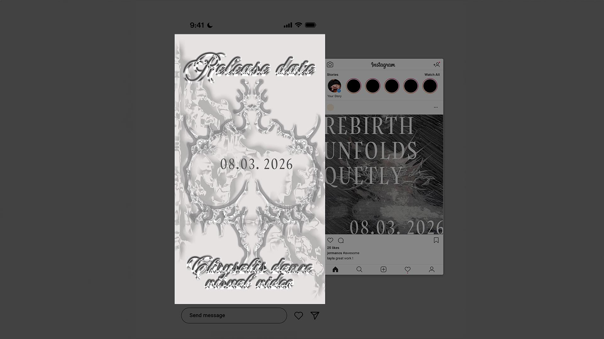
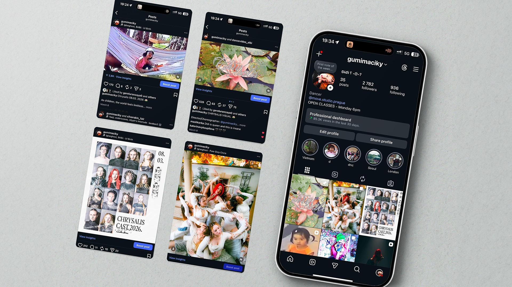
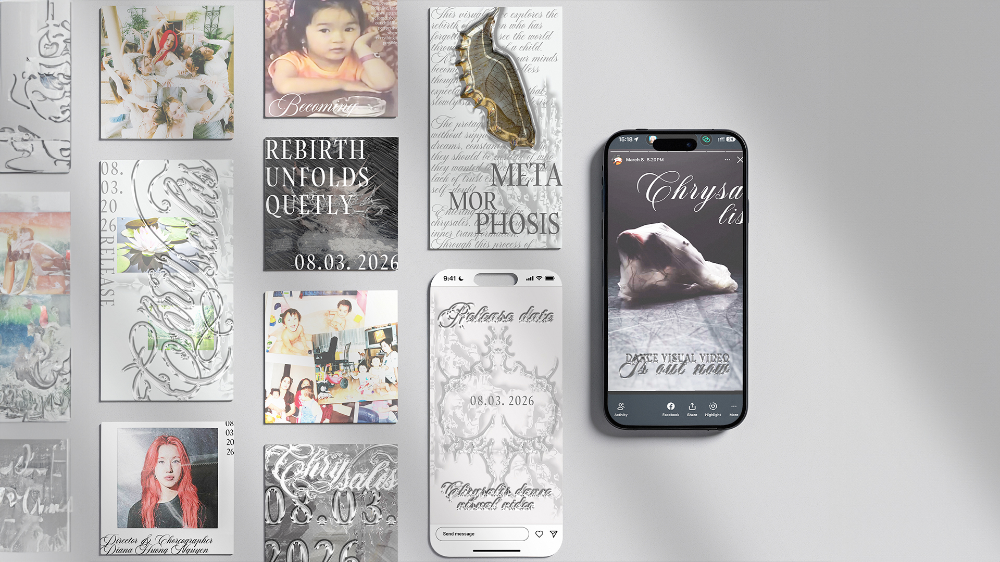
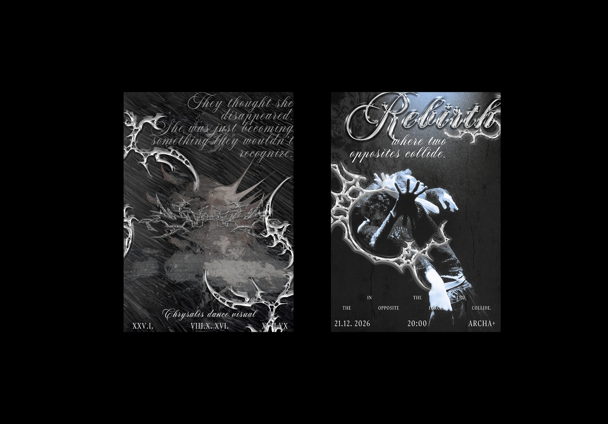
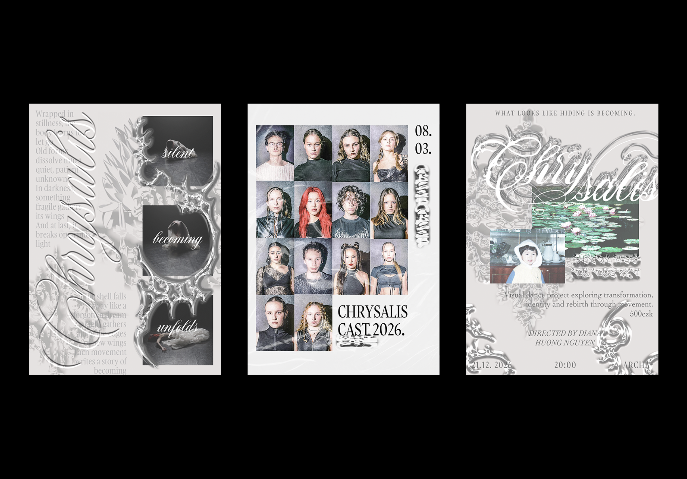

# Case Study: Chrysalis Dance Visual

Project Type: Bachelor’s Thesis – Visual Identity & Dance Video
Deliverables: Logo, Posters, Tickets, Social Media, Invitation, CD & Vinyl Packaging

### The Concept 
The word Chrysalis represents the state of transformation—the protected, yet vulnerable stage of rebirth from the cocoon. For this dance visual project, I wanted to capture not only a story told through movement in the video, but also showcase it deliverables I created. My main goal is to people the understand the deeper meaning and evoke emotions and realisation of who we are. 

### Branding & Visual Assets

The identity system was designed to be "portable" and cohesive across various physical and digital touchpoints:

Logo Design: A complex, chrome-textured script that mirrors the fluid movement of the dance. It is featured prominently against contrasting organic backdrops, like the lily pads in the opening visual.

### The Ticket

Styled as a thermal-printed receipt, this piece "chunks" information logically—listing the premiere date (21/12/2026), time (20PM), and location (ARCHA+) alongside a stylized butterfly chrysalis.

 

### Music Packaging

Vinyl: Large-format sleeves featuring high-contrast photography and the "Chrysalis" wordmark.

CD: A metallic, reflective disc design that plays with light, paired with lyric/poetry booklets.

Invitations: A refined, tactile experience using cream-toned paper, wax seals, and delicate typography to invite the audience into the "dance visual experience."

### Digital & Social Strategy

Following the principles of "accessible language" and "emotional clarity," the social media suite was developed to build anticipation:

Instagram Grid & Stories: A mix of cast photography, "Rebirth" teaser posters, and behind-the-scenes clips.

Release Date Countdown: High-impact "liquid metal" story templates focused on the key date: 08.03.2026.

Natural Pacing: Video snippets are timed to mirror the dancer's movements, providing a seamless transition from the screen to the final performance.

 
 
 

### Poster Series: The "Becoming" Trio

The poster campaign was divided into three distinct visual chapters:

The Process: "Silent, Becoming, Unfolds" — featuring fragmented motion shots within chrome frames.

The Cast: A structured grid layout introducing the 2026 performers.

The Environment: A surrealist composition blending childhood nostalgia (the water lily) with high-fashion typography.

 
 

